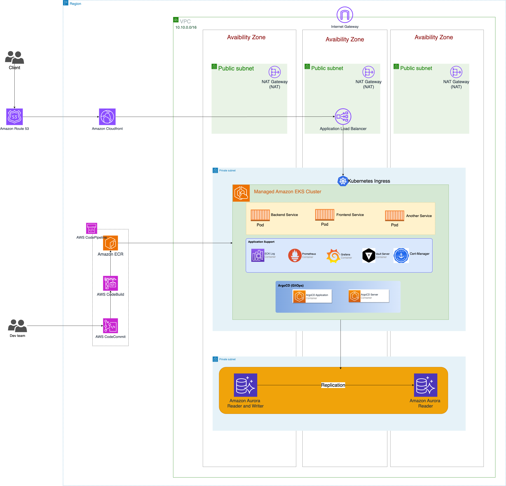

# creative-force-test

**Architecture Overview**

## Requirements

- [Terraform](https://www.terraform.io/downloads.html)
- [AWS CLI](https://docs.aws.amazon.com/cli/latest/userguide/install-cliv2.html)
- [AWS EKS]()
- [Gitops]()

## Solutions

***I chosen AWS cloud***

**Networking**
  
- I created a dedicated VPC for this project. In my VPC, I created a public subnet and a private subnet for each Availability Zones in the region. A private subnet does not have a direct route to the internet, which means that instances launched in that subnet cannot access resources on the internet or be accessed from the internet. To allow instances in a private subnet to access the internet, I used a NAT Gateway (NGW). 
- A NAT Gateway is deployed in a public subnet and acts as a bridge between instances in the private subnet and the internet. When an instance in a private subnet sends a request to the internet, the request is forwarded to the NAT Gateway, which replaces the instance’s private IP address with the NAT Gateway’s public IP address and sends the request to the internet. When the response is received, the NAT Gateway translates the response back to the instance’s private IP address and sends it back to the instance.
- To increase high availability for NGW, I created one NGW in each public subnet.

**Database**
- I chose to use Aurora instead of running postgres directly to avoid dealing with persistent state in the k8s cluster or minimize future operational efforts. Amazon Aurora is a fully managed database service, which means AWS takes care of routine database tasks like patching, backups, and scaling, allowing I to focus on building my application.
- Amazon Aurora is designed for high performance and low latency. It provides up to five times the throughput of standard MySQL and PostgreSQL databases. This makes it suitable for applications with demanding performance requirements. Aurora can easily scale database up or down as my application's needs change. It supports auto-scaling, which can automatically adjust the database's capacity to handle varying workloads.
- Amazon Aurora provides high availability and fault tolerance. It replicates data across multiple Availability Zones (AZs), which ensures that my database remains available even in the event of an AZ failure.
- Amazon Aurora offers automated backups and point-in-time recovery. I can easily restore my database to a specific point in time, which is important for data protection and disaster recovery.
- Amazon Aurora provides a Writer for write operations, ensuring data consistency and durability, and one or more Readers for read operations, enhancing read performance, scaling, and high availability. This architecture allows to balance the workload, achieve fault tolerance, and improve overall database performance by distributing read traffic across multiple read replicas while maintaining data integrity through replication from the Writer.
  - Aurora Writer (Primary Instance):

    - Write Operations: The Aurora Writer is the primary database instance responsible for handling write operations (INSERT, UPDATE, DELETE) on the database. It is the authoritative source for data modifications.

    - High Availability: Aurora Writer is designed for high availability and durability. Data written to the Writer is replicated across multiple Availability Zones (AZs) for redundancy and fault tolerance. If the Writer instance fails, Aurora automatically promotes a read replica to become the new Writer, ensuring minimal downtime.

    - Failover: In the event of a Writer instance failure, Aurora triggers an automatic failover, promoting a read replica to become the new Writer. Failovers are usually transparent to applications and result in minimal disruption.

    - Scaling: Aurora Writers can be scaled vertically to handle more write traffic, and I can also increase the size of the underlying storage volume as my data grows.
  - Aurora Readers (Read Replicas):

    - Read Operations: Aurora Readers are read-only database instances that are asynchronously replicated from the Writer. They can handle SELECT queries and other read-intensive operations. These Readers provide horizontal scalability for read traffic.

    - High Availability: Aurora Readers can be placed in different Availability Zones, allowing I to distribute read traffic and increase availability. If one reader fails, others remain accessible.

    - Scaling: I can create multiple Aurora Readers to distribute read traffic and improve the overall performance of my application. Aurora automatically handles replication and keeps the Readers up to date.

    - Load Balancing: I can configure my application to distribute read traffic across multiple Aurora Readers using load balancing or connection pooling. This helps optimize the performance of read-heavy workloads.

    - Read Consistency: Aurora Readers provide read consistency, ensuring that the data retrieved from a Reader is up to date with the latest committed transactions.
  

**Amazon EKS**
- We have packaged the applications by creating docker images for them, so I will use EKS to deploy these applications there.
- To achieve zero downtime updates for components in Kubernetes, we can combine strategies as follows:
  - Rolling Updates: Kubernetes supports rolling updates for applications. When I update an application's Deployment or StatefulSet, Kubernetes ensures that a new version of the application is gradually deployed while the old version is gradually retired. This rolling update strategy prevents service disruption. I also use `Readiness and Liveness Probes` to define readiness and liveness probes for ,my containers. Readiness probes indicate when a container is ready to receive traffic, while liveness probes detect when a container is healthy and should continue running. These probes ensure that only healthy containers receive traffic.
  - Blue-green: I'll show in next section

- To horizontally scale the application automatically, I will use Horizontal Pod Autoscaling (HPA) in Kubernetes, and to automatically horizontally scale the nodes in EKS, I will use the [Auto Scaler](https://github.com/kubernetes/autoscaler).
  - HPA: automatically scales the number of pods in a Deployment, ReplicaSet, or StatefulSet based on observed CPU utilization or other select metrics. This allows my application to handle varying loads efficiently without manual intervention. Here's how HPA works:
    - Metrics Collection: HPA collects metrics from my application, such as CPU usage or custom metrics, depending on my configuration.

    - Comparison to Desired Metrics: HPA compares the collected metrics to the desired metric values I've defined in my HorizontalPodAutoscaler resource.

    - Decision Making: Based on the metric values, HPA makes a decision about whether to scale the number of pods up or down to maintain the desired metric values.

    - Scaling: If scaling is necessary, HPA updates the number of desired replicas, and Kubernetes automatically adds or removes pods to meet the new replica count.

    - Continuous Monitoring: HPA continues to monitor metrics and make scaling decisions as needed.
  - [Auto Scaler](https://github.com/kubernetes/autoscaler): Cluster Autoscaler is a tool that automatically adjusts the size of the Kubernetes cluster when one of the following conditions is true:
    - there are pods that failed to run in the cluster due to insufficient resources.
    - there are nodes in the cluster that have been underutilized for an extended period of time and their pods can be placed on other existing nodes.

**Git & CICD follow**
- We have several different Source Code Management (SCM) systems, but for this project, I will use CodeCommit, a service available on the AWS cloud, it offers a secure and scalable platform for hosting and managing Git repositories.
- I used AWS Codebuild for my CI processes & build docker images. It is a fully managed continuous integration service that compiles source code, runs tests, and produces software packages. It supports multiple programming languages and build environments. And I used CodePipeline to manage and automate the release process, ensuring that code changes are consistently built, tested, and deployed in a controlled and predictable manner.
- So, How They Work Together:
    - CodeCommit is used to store my source code repositories.
    - CodePipeline is used to define and automate software release process, and it can trigger pipeline execution on code changes in CodeCommit.
    - CodeBuild is used to compile, build, and test my code, and it can be used as a build action within a CodePipeline stage.
- I also use AWS ECR - a fully managed container image registry service provided by Amazon Web Services (AWS). It's designed to store, manage, and deploy Docker container images. ECR is tightly integrated with other AWS services, particularly Amazon Elastic Container Service (ECS) and Amazon Kubernetes Service (EKS), making it a key component of AWS's containerization ecosystem.

*CICD follow*
- I'll design CI/CD in a branching model. We will have branches corresponding to deployment environments such as dev, staging, and production.
  
  **1. Codebase Setup:**
Developers work on a shared codebase, usually stored in a version control system (e.g., Git).
A typical branching model includes a `develop` branch and feature branches.

  **2. Feature Development**
Developers create feature branches for new features, bug fixes, or improvements.
These branches are isolated from the `develop` branch, allowing independent development.
Developers commit their changes to these feature branches.

  **3. Pull Requests (PRs)**
Developers create PRs (or merge requests) to propose merging their feature branch into the `develop` branch.
The PR undergoes code review, where team members review and discuss the changes.
CI pipelines are triggered for PRs to ensure they don't introduce issues into the `develop` branch.

  **4.Merging and develop**
After merge code from feature branch to `develop` branch, CI will be running. 
If the CI pipeline fails, developers are alerted to fix the issues.
If the CI pipeline passes, it indicates that the feature branch's code is stable.

Developers create PRs (or merge requests) to propose merging `develop` branch to `staging` branch.

  **5. Merging and Staging**
Once a PR is approved, it's merged into the `staging` branch.
The `staging`` branch represents the staging environment
CI/CD pipelines are triggered on the `staging` branch to prepare for deployment.

  **6. Continuous Deployment (CD)**
CD pipelines automatically deploy the application to staging or develop environments for further testing.
Automated tests, such as integration, regression, and performance tests, are run in these environments.
If the tests pass, the code is considered ready for production.

  **7. Production Deployment**
Once the code is thoroughly tested and validated in staging, it's deployed to the production environment via `prod` branch.
We create PRs to propose merging `staging` branch to `prod` branch. 
The CD pipeline handles the deployment, which may include blue-green deployments, or rolling updates to ensure zero downtime.
  **8. Monitoring**
Post-deployment, monitoring tools track the application's performance and health.
If any issues arise, the CI/CD process can be used to quickly fix and redeploy the application.

*Gitops System*
- The output of my CI process is a docker image pushed to storage in a private ECR.
- In CD step, I will integrate a GitOps system into the Continuous Deployment (CD) process by using the ArgoCD ecosystem, which includes ArgoCD, Argo Rollout, Argo CD Image Updater. I have deployed them into EKS cluster. I also created other repository to store my code for deployment such as manifest file of k8s, ArgoCD configuration files or helm chart template for deploying my appication. When changes are pushed to the repository, ArgoCD detects them and starts a reconciliation process and ArgoCD automaticly trigger this repository to deployment applition on EKS.
- In CD process, when docker image is pushed to AWS ECR, Argo CD Image updater can check for new versions of the container images that are deployed with your Kubernetes workloads and automatically update them to their latest allowed version using Argo CD. I use Argo Rollout to apply blue-green deployment for my applications. To use Argo Rollouts, create a custom resource called a `Rollout` in k8s. This resource specifies how Blue-Green deployment should work. The Rollout manages two Replica Sets: the "Blue" Replica Set and the "Green" Replica Set. The "Blue" represents the existing version of my application, while the "Green" represents the new version. Initially, all traffic is directed to the "Blue" Replica Set, which serves the current production version of my application. Deploy new version to the "Green" Replica Set, but without routing any traffic to it. If everything looks good, I can promote the "Green" Replica Set to become the new production version, and the old "Blue" environment is retired.
If issues are detected during analysis, I can easily roll back to the previous version by shifting traffic back to the "Blue" Replica Set.

**Security**
- To security in transit, I have used cert-manager to automates the process of obtaining, renewing, and managing TLS certificates. Cert-Manager has built-in support for Let's Encrypt, a popular Certificate Authority (CA) that provides free TLS certificates. This integration simplifies the process of obtaining TLS certificates from Let's Encrypt. It simplifies the certificate lifecycle management, reducing the need for manual certificate handling. Cert-Manager is designed to work seamlessly with Kubernetes, making it an ideal choice for securing applications and services running in Kubernetes clusters. It leverages CustomResourceDefinitions (CRDs) to configure and manage certificates. Cert-Manager automatically handles certificate renewal and rotation. This is critical for maintaining the security and availability of applications and services.

- To security at rest, especially data. Amazon Aurora provides encryption by default, which means all data at rest is encrypted when you create a new Aurora DB cluster. For Data in Transit Encryption, we can use SSL/TLS encryption for data in transit (data traveling between your application and the database).
